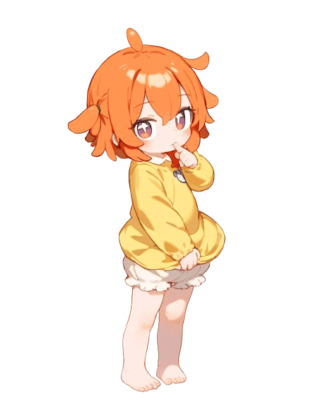

# 写写bug：
```
Changelog：
1、新增帮助：
   #派蒙绘图帮助
   #派蒙绘图帮助pro
   #派蒙绘图收藏帮助

2、增加更多控制，防止调皮的群友：
   #ap全局设置绘多图(开启|关闭)
   #ap全局设置更改绘图参数(开启|关闭)
   #派蒙(绘|画)图删除用户(绘|画)图(设置|参数)
   #派蒙(绘|画)图设置最大宽高(帮助)
```
```
git clone https://github.com/misaka20002/ap-plugin.git ./plugins/ap-plugin
```
* **#ap设置** 
  * 查看当前ap策略
* **#ap设置查水表** [ **开启**|**关闭** ]
  * 设置是否允许群员查水表
* **#ap设置通知主人** [ **开启**|**关闭** ]
  * 开启后，有人绘制违规图片时将通知主人
* **#ap** [ **全局** ] **设置** [ `群号`|**私聊** ] **次数** [ `数字`|**无限** ]
* **#ap** [ **全局** ] **设置** [ `群号`|**私聊** ] [ **个人cd**|**群聊cd**|**撤回时间** ] `数字`
* **#ap** [ **全局** ] **设置** [ `群号`|**私聊** ] [ **审核**|**撤回**|**封禁**|**绘多图**|**更改绘图参数** ] [ **开启**|**关闭** ]
  * 竖线表示不能共存，方括号中为可选内容(使用时不带方括号)
  * **全局**：此次配置对`所有群`生效
  * **群号**：指定群号，此次配置对`该群`生效
  * **私聊**：此次配置对`私聊`生效
  * ps:若未指定全局、群号、私聊，则此次配置对发送消息所在的`当前群`生效
  * **次数**：设置每人每日限额，即每日可绘图的张数。每日0点刷新
  * **个人cd**：每个人绘图之后再次使用绘图需要等待的时间，单位是秒
  * **群聊cd**：整个群聊内共享的cd,群内有人使用绘图之后该群内再次使用绘图需要等待的时间，单位是秒
  * **撤回时间**：指定发送绘制的图片后多久自动撤回，单位是秒，最大`120`
  * **审核**：图片发送前，先使用百度图片审核服务检测图片安全性
  * **撤回**：图片发送后，经过指定的时间之后自动撤回
  * **封禁**：开启后，将封禁试图使用屏蔽词绘图的用户
  * **绘多图**：开启后，可以绘制超过1张但不超过10张图片
  * **更改绘图参数**：开启后，允许用户更改自己的绘图参数
* **#ap** [ **添加**|**删除** ] **屏蔽词** 
* **#ap屏蔽词列表** 
* **#ap** [ **封禁**|**解封** ]  [ `qq号`|`@某人`]
  * 被封禁的用户无法使用ap插件的功能
* **#ap** 设置存本地[ **开启**|**关闭** ]
  * 开启后绘制的图片将保存在云崽resources/yuhuo/aipainting目录下，用于`查水表`等功能
* **#撤回**
  * 对机器人的消息回复此命令,以撤回该消息
* **#派蒙绘图帮助** [ **pro** ] 
* **#绘图设置最大宽高帮助**




# AP-PLUGIN🍊

- 一个适用于 [Yunzai 系列机器人框架](https://github.com/yhArcadia/Yunzai-Bot-plugins-index) 的的 AI 绘图插件，让你在输入框中拥有便捷的 AI 绘画体验

- 使用开源的 [Stable Diffusion web UI](https://github.com/AUTOMATIC1111/stable-diffusion-webui) 作为后端，自己免费部署，生成的图片多样化，功能更加丰富

- **使用中遇到问题请加 QQ 群咨询：[707331865](https://qm.qq.com/q/TXTIS9KhO2)**

> [!TIP]
> 这个插件是我刚接触 Yunzai 时，和一个叫 [渔火](https://github.com/yhArcadia) 的大哥哥一起写的（其实我就是在他的插件上面加乱七八糟的东西，导致现在这么臃肿）。他是我的启蒙老师哦，之前我是一点 JavaScript 都不会的。现在他都退坑了都找到女朋友啦！

## 安装插件

#### 1. 克隆仓库

```
git clone https://github.com/misaka20002/ap-plugin.git ./plugins/ap-plugin
```

> [!NOTE]
> 如果你的网络环境较差，无法连接到 Github，可以使用 [GitHub Proxy](https://mirror.ghproxy.com/) 提供的文件代理加速下载服务
>
> ```
> git clone https://ghp.ci/https://github.com/misaka20002/ap-plugin.git ./plugins/ap-plugin
> ```

#### 2. 安装依赖

```
pnpm install --filter=ap-plugin
```

## 插件配置

> [!WARNING]
> 非常不建议手动修改配置文件，本插件已兼容 [Guoba-plugin](https://github.com/guoba-yunzai/guoba-plugin) ，请使用锅巴插件对配置项进行修改

- 关于部署 Stable Diffuison，请自行在网上寻找教程，这里放一个 [秋葉 aaaki 的教程](https://www.bilibili.com/video/BV1iM4y1y7oA)

- 关于部署 HuggingFace 平台的相关功能，本插件作者不再维护这些功能，请自行寻找教程

- 旧版的配置文档已归档在 [ap-plugin-website](https://github.com/AiPreface/ap-plugin-website/tree/main/docs/Config)，有需要可自行查看

## 功能列表

请使用 `#ap帮助` 获取~~完整~~帮助（藏了些小彩蛋功能）

- [x] 基本生成图片
- [x] 二次元的我
- [x] 鉴赏解析图片 Tags
- [x] 局部重绘
- [x] 控制网基础（需要后端安装 ControlNet）
- [x] 使用 Embedding 和 Lora
- [x] 图片存本地
- [x] 本地预设功能
- [x] 独立设置绘制参数
- [x] 多接口翻译
- [x] 切换模型
- [x] 远程下载模型（需要部署 AP 助手）
- [x] 识别动漫人物
- [x] 图片差分
- [x] 以图搜源
- [x] 卢浮宫滤镜（需要安装 Canvas 依赖）

## 常见问题

1. 我的电脑能不能画图？
   - 建议使用 NVIDIA GeForce GTX 1660 以上的独立显卡，没有独立显卡的电脑不推荐部署。
2. 为什么我部署了，网页端正常画，插件使用不了？
   - 请检查你的后端服务器能被机器人服务器访问。
   - 请在启动器中打开 `启用API` 选项，或在启动参数中加入 `--api`。

## 支持与贡献

如果你喜欢这个项目，请不妨点个 Star🌟，这是对开发者最大的动力， 当然，你可以对我 [爱发电](https://afdian.net/a/sumoqi) 赞助，呜咪~❤️

有意见或者建议也欢迎提交 [Issues](https://github.com/AiPreface/ap-plugin/issues) 和 [Pull requests](https://github.com/AiPreface/ap-plugin/pulls)。

## 相关项目

- [Stable Diffusion web UI](https://github.com/AUTOMATIC1111/stable-diffusion-webui)：Stable Diffusion web UI
- [ControlNet](https://github.com/lllyasviel/ControlNet): Let us control diffusion models!

## 许可证

本项目使用 [GNU AGPLv3](https://choosealicense.com/licenses/agpl-3.0/) 作为开源许可证。
